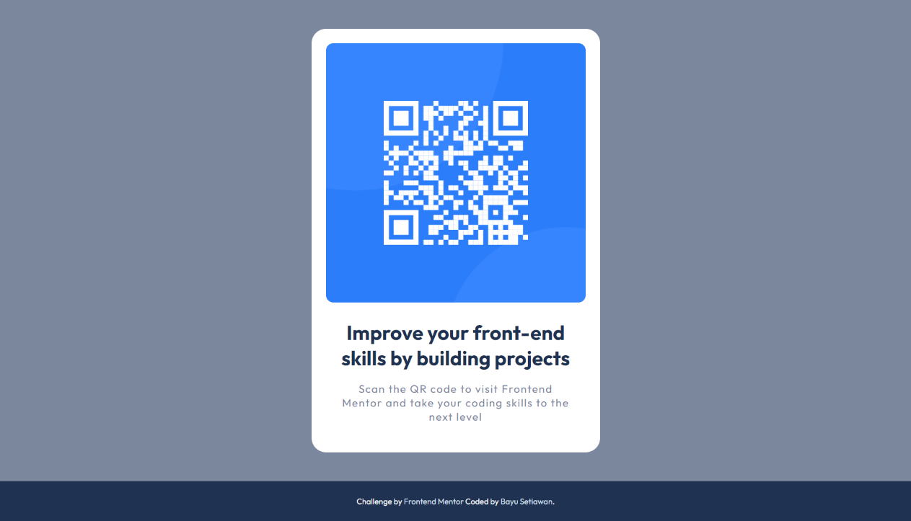

# Frontend Mentor - QR code component solution

This is a solution to the [QR code component challenge on Frontend Mentor](https://www.frontendmentor.io/challenges/qr-code-component-iux_sIO_H). Frontend Mentor challenges help you improve your coding skills by building realistic projects.

## Table of contents

-   [Overview](#overview)
    -   [Screenshot](#screenshot)
    -   [Links](#links)
-   [My process](#my-process)
    -   [Built with](#built-with)
    -   [What I learned](#what-i-learned)
-   [Author](#author)

## Overview

### Screenshot



### Links

-   Solution URL: [Add solution URL here](https://your-solution-url.com)
-   Live Site URL: [https://qr-code-component-bayu.netlify.app](https://qr-code-component-bayu.netlify.app)

## My process

### Built with

-   Semantic HTML5 markup
-   CSS custom properties
-   Flexbox
-   Mobile-first workflow

### What I learned

Use this section to recap over some of your major learnings while working through this project. Writing these out and providing code samples of areas you want to highlight is a great way to reinforce your own knowledge.

HTML Structure:

-   Utilized semantic HTML elements such as <main>, <section>, and <aside> to improve the document structure.
-   Provided descriptive alternative text (alt) for the QR code image and used aria-label for additional accessibility.

CSS Styling:

-   Implemented a responsive design approach using a combination of flexbox and media queries.
-   Utilized CSS custom properties (variables) for color definitions to maintain consistency and ease of customization.
-   Employed a mobile-first design approach by adjusting styles for smaller screens using a media query.

```
@media screen and (max-width: 568px) {
    /* Responsive adjustments for smaller screens */
    .card .qr-text {
        padding: 0 5px;
    }

    .card .qr-text h1 {
        font-size: 22px;
    }

    .card .qr-text p {
        letter-spacing: 0.8px;
    }
}
```

Color Palette and Theming:

-   Defined a color palette using CSS custom properties in the :root selector.
-   Maintained a consistent color theme throughout the project for background, text, and other elements.

Accessibility Considerations:

-   Ensured that all images have appropriate alternative text for accessibility.

```

```

Responsive Design:

-   Implemented responsive design principles to ensure the project looks good and functions well on various screen sizes.

```
@media screen and (max-width: 568px) {
    /* Styles for smaller screens */
}
```

## Author

-   Website - [Bayu Setiawan](https://bayu-setiawan.netlify.app)
-   Frontend Mentor - [@bayu275](https://www.frontendmentor.io/profile/@bayu275)
-   Linkedin - [Bayu Setiawan](https://www.linkedin.com/in/bayuusetiawan)
